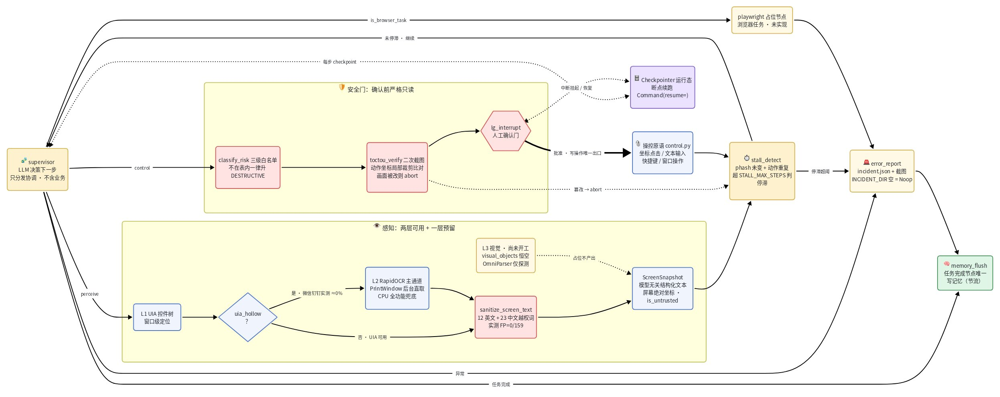
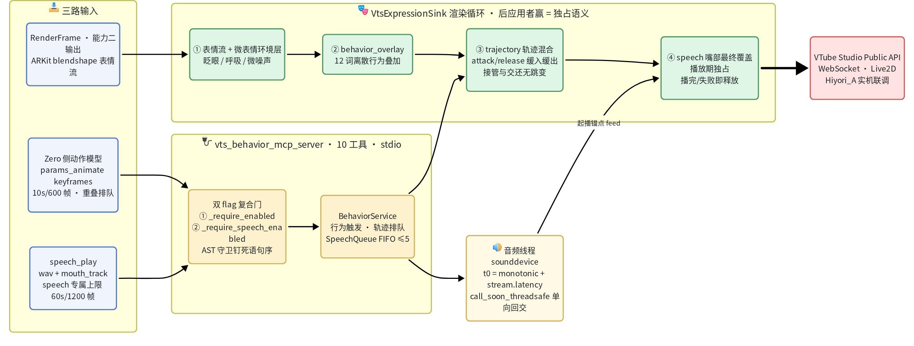

# Zero_MCP

经 **MCP（[Model Context Protocol](https://modelcontextprotocol.io)）**，给情感引擎驱动的 AI 数字人项目 **Zero** 扩展新的 **Agent 能力模块**。Zero_MCP 与 Zero 相对独立：把 Zero 当作**外部服务**经 MCP 调用，不直接耦合其代码库。

已落地三条能力线：**「桌面屏幕感知 + 电脑操控」**（Task 1-14 收口 + K1-K8 加固，真实桌面端到端标定）、**「Zero↔MCP 情感对接（zero-link）」**（第二阶段：契约层 + client 真连 + 三模态感知真接入 + 真采集 I/O 适配层 + 表达映射器 + physiology 消费门控 + EDA 唤醒度量 v2）与 **「VTube Studio Live2D 渲染终端 + 离散行为层」**（expression 表情流直驱 + 裸参数轨迹通道 + `speech_play` 语音播放口型同步）。另已落地**记忆层 + 存储层与编排层的持久化接线**（ScopedMemoryAPI + SQLite 后端 + 组装根，默认关零回归）。后续能力沿同一架构扩展。

## 能力一：桌面屏幕感知 + 操控

让 Agent 感知 Windows 桌面并执行操作，输出**模型无关的结构化文本**（不假设消费方是多模态模型）。

- **感知栈：两层可用 + 一层预留**。L1 UIA 系统接口（控件树，窗口级定位）· L2 RapidOCR（文本主通道，**实际主力**）· L3 视觉**尚未开工**（`visual_objects` 恒为空列表，OmniParser 只做能力探测不跑推理，OpenCV 模板匹配无任何实现）。**零训练**（不自训任何模型）；**GPU 可选**——启动期按 CUDA>DirectML>CPU 探测 ONNX EP 并写进 `capability_flags`，但该选择当前只用于门控 OmniParser 与日志，**OCR 推理路径尚未消费它**（CPU 全功能兜底）。
- **定向后台感知**：`screen_snapshot(window_handle=)` 指定目标窗口，经 `PrintWindow(PW_RENDERFULLCONTENT)` 直取窗口自身 DWM 渲染面——**被遮挡/无焦点/压 z 序底均可感知，不打扰正在用机的用户**；坐标恒为屏幕绝对（可直接驱动点击）。
- **关键实证**：微信 4.1.11.24（mmui 自绘）与钉钉 7.x 的 UIA 内容树实测覆盖率均 **≈0%**（钉钉 7/7 界面 hollow）——故感知默认 OCR 主通道、操控主路径为坐标点击，逐窗口探测 `uia_hollow` 自动切 OCR。
- **LangGraph 编排**：7 节点 StateGraph + 3 条件边，高危动作经 `interrupt` 人工确认门，三信号停滞检测 + 断点续跑（Checkpointer）。
- **安全护栏在编排层**：三级白名单（不在表内一律升 DESTRUCTIVE）+ TOCTOU 二次截图比对（动作坐标 ±`TOCTOU_CROP_HALF_PX` 局部裁剪口径）+ 屏幕文字注入过滤（12 条英文 + 23 条中文越权词表，实测 FP=0/159）；不依赖模型层防御。
- **K1-K8 加固**（2026-08-05 审计八真缺口三轨落地）：锁屏/会话状态检测、落点核验（点击后 `WindowFromPoint` + OCR 锚点验证 `anchor_verify`——Win32 前台/标题/CLOAKED 状态会撒谎，像素锚点才可信）、前台获取梯级、定向感知默认装配、步骤记录 `step_record` 回路等；审查门 PASS。遗留：ActionSpec 生成层与两处工程假设的实机标定。

感知 → 安全门 → 操控 → 停滞/续跑的一轮闭环：



> 图源 [`docs/v2/desktop-pipeline.mmd`](docs/v2/desktop-pipeline.mmd)（mermaid，飞书画板渲染）。

交付质量：单测 + 53 条行为 evals 全绿，ruff + mypy strict 通过，独立 code-reviewer 审查 PASS；真实钉钉 7 个功能界面端到端标定 **7/7** 全通过，OCR conf（各界面均值再平均）0.954，快照延迟 0.72–2.03s（均值 ≈1.2s）。⚠ 后三项是一次性标定记录（依据在本地 `notes/e2e-desktop-task-results.md`，不入库），**不是 CI 持续回归项**。

## 能力二：Zero↔MCP 情感对接（zero-link）

把 Zero 的情感/认知内核当**外部服务**经 MCP 对接：输入端把多模态感知归一成 `(valence, arousal)` 先验注入内核，输出端消费内核每轮的 `expression` 字典驱动渲染。**不 import Zero 代码库**——协议结构化镜像 + 跨仓活体回归（pytest marker `zerorepo`，`D:\Zero` 不在位自动 skip）。

- **边界契约层**：跨层数据形状唯一真相 `src/agents/models/zero_affect.py`（pydantic，字段/量纲逐条对 Zero 源码现场核验）——`(v,a)[+coping]` 刺激、多模态**独立先验流**（禁均值，竞争融合归内核）、`spontaneous`/`voluntary` 双通路 × 4 通道 expression（13 维 FACS〔12 AU + intensity 强度标量〕/ 韵律 / 生理 / 标签）。
- **Zero MCP client**（`ZeroLinkClient`）：会话句柄三段式 `zero.open_session / step / close_session` + `graceful_step` 优雅回退；stdio（本地子进程）与 Streamable HTTP（远程）双传输经 `.env` 切换，HTTP 侧 Bearer 鉴权、跨重启 resume、unknown-session 机读区分均已对齐 Zero 上线形态。**已与 `D:\Zero` 真 MCP server 端到端联调通过**（stdio + HTTP + 真 13 维 FACS 权重全契约验证）。
- **三模态感知真接入**（算法团队文献门选型，全程可点击引文）：生理 **EDA + HRV**（EDA = SCL 窗间基线 Δ〔纯 numpy，不依赖 NeuroKit2〕· HRV = NeuroKit2 RMSSD，二者经 ω=0.5 协方差交叉预合并为单条 `physio` 流）· 语音 audeering w2v2 维度 SER · 视觉 EmotiEffLib **ONNX 后端**（零 timm，不动共用 conda 环境）。全部 pip 直装、CPU 可跑、零自训；缺库/缺模型/无输入一律 warning + 单通道降级，不拖垮整体。
- **EDA 唤醒度量 v2**（2026-07-29 起**唯一路径**，无 env 开关）：`scl_baseline_delta` = 窗内原始 SCL 均值 − 近 30 分钟各窗 SCL 中位数基线 → 对称归一化。**不做 phasic 分解**（实测窗内 `mean(eda)` 与 `EDA_Tonic.mean()` 相对差 <0.1%），连带消除 cvxEDA/highpass 双分支这个跨采样率失败成因。v1 的 `scr_amplitude` 经 WESAD 真被试实测与唤醒**系统性反相关**（「stress>baseline」正确率 1/5，经典 SCL 是 4/5），已连同 `ZERO_EDA_AROUSAL_METRIC` 开关一并删除。⚠ **冷启动约 4.5 分钟返回 `None`**（无基线证据不臆造读数），期间生理流有意降级为裸 `hrv/rmssd`。⚠ 两通道成熟度不对称：EDA 经 WESAD 全会话回放验收，**HrvChannel 仍是单一固定 ref、零跨被试自适应的初版**（判别力正常但抗漂移不及格，待独立立项改造）。
- **真采集 I/O 适配层**（`io_adapters/`）：把本地文件 / 合成信号包装成 async `signal_source` 注入四通道——`make_audio_file_source`（librosa 16kHz mono）· `make_vision_file_source`（FaceDetectorYN 人脸裁剪，BGR→RGB）· `make_synthetic_eda/hrv_source`（NeuroKit2）；**真硬件已实现**（`hardware_adapters`）：`make_mic_source`（sounddevice）· `make_camera_source`（cv2 VideoCapture + 可选 YuNet 人脸裁剪，即开即关不占设备）· `make_wearable_source`（pyserial 串口）——依赖为可选 extra（`hardware-audio` / `hardware-wearable`，默认不装），**工厂构造永不抛**，缺库/无设备/读取失败一律回退 `None`。适配层经构造器注入、**不进 Channel 核心**、脱硬件可测。
- **表达映射器**（引擎无关）：`ArkitFacsMapper`（12 AU → ARKit 标准 52 blendshape 命名空间中的 21 个，intensity 作全局增益，稀疏输出）· `LinearProsodyMapper`（韵律→倍率/半音/dB，可出 SSML `<prosody>`）· `LinearPhysiologyMapper`（**WESAD canonical**：心率/呼吸 + 皮肤电导 μS 归一 + 体温 °C）；经 `RenderingExpressionSink` 产出 `RenderFrame`（`DUAL` 策略含 spontaneous 微表情泄漏帧——"真笑/假笑"表现力来源）。
- **physiology 契约 = WESAD 真信号**：canonical 三键 `{heart_rate_bpm, skin_conductance(μS[0,20]), temperature_c(°C)}`。跨仓迁移不原子，**保超集不收窄**（2026-07-23 定论、非过渡态：`hr`+`sc` 必填，`temperature_c`/`pupil_mm` **恒可选**）——收到 Zero 的 legacy 或 canonical 两形状都不 `ValidationError`。⚠ **保超集 = 解析层零回归 ≠ 消费标度正确**：mapper 按 μS 标定，连 legacy 门关 Zero（sc∈[0,1]）须显式配 `skin_conductance_max_us=1.0`，否则默认再除 20 → 静默欠标度 ~20×（对抗审查揪出的 W6）。
- **出境守卫**：`external_priors` 多流逐维 `(Πv,Πa)` 精度载荷 + 客户端 fail-fast——M3 精度上界 / M6 流数上界（按**合并后**计数）/ M7 μ 域校验 / Π 有限性校验（`isfinite` 先于上界判定，堵 NaN 静默穿透），M5 schema 版本跨仓断言（`zerorepo` 测试期）。校验装在**出网函数**、作用于最终出线的值——构造期校验挡不住赋值/`model_construct`/鸭子类型四条绕过路径。
- **默认关零回归**：`ZERO_LINK_ENABLED` 与三个感知通道 flag 全部默认 `false`，不影响既有能力。

zero-link 一轮数据流（感知先验注入 → Zero 确定性计算 → 表达消费驱动渲染）：


> 图源 [`docs/v2/zero-link-dataflow.mmd`](docs/v2/zero-link-dataflow.mmd)（mermaid，飞书画板渲染）。

## 能力三：VTube Studio 渲染终端 + 离散行为层

Zero 情感内核的 `expression` 输出经 MCP 驱动 Live2D 数字人（VTube Studio Public API，WebSocket）；已与 Hiyori_A 实机端到端联调 + 两轮标定。分界由用户拍板：**参数通道归 MCP，自然度归 Zero 侧动作模型**。

- **表情流 sink**（`sinks/vts.py::VtsExpressionSink`）：消费 `RenderFrame`（能力二的输出），ARKit blendshape → VTS 输入参数注入；`VTS_SINK_EXPRESSIVENESS` 幅度增益 + 微表情环境层（眨眼/呼吸/微噪声）。
- **离散行为层**（`vts_behavior_mcp_server.py`，独立 MCP server，10 工具）：12 词离散行为 + 热键枚举/触发（标定期兜底）；主通道是 `params_animate` **裸参数轨迹通道**——Zero 侧动作模型经 keyframes 直驱任意 Live2D 输入参数（Hiyori_A 全 127 参数实测），attack/release 缓入缓出接管与交还、无跳变；上限 10s/600 帧，重叠调用排队。已消化 Zero motion 门控回件（motion-disabled 归不可降级错误子类、describe_config v4/v5 键登记、errorID 51 自解释处置文案）。
- **`speech_play` 语音播放 + 口型同步**（2026-08-14，Zero 开工件）：wav 播放（sounddevice `RawOutputStream` + stdlib `wave`，零 numpy）+ `mouth_track` 口型轨迹**独占嘴部**（`TrajectoryPlayer` 挂渲染循环最终覆盖层，播完/失败即释放）；`mouth_track` 沿用 `params_animate` 的关键帧形状，但上限为 speech 专属 **60s/1200 帧**（应 Zero chat 语料实测 0.17s/字放宽；`params_animate` 的 10s/600 不动）；重叠调用 FIFO 排队（上限 5，满则 `[vtsb:throttled]`）。成功回包 `{accepted, duration_ms}` 是**跨仓锁定的字面形状**（Zero 先行合入的单测按它写，故意不套本仓 status/code 三态惯例）。⚠ 音画对齐 ≤80ms 目前是工程论证（`t0 = monotonic() + stream.latency`），真机 chat 联调未做，联调过前不宣称达标。
- **MCP stdio 预热纪律**（`src/mcp/native_warmup.py`）：stdio server 进事件循环后在工具体内**首次 import numpy 系依赖会无限期死锁**（Zero 实机 `vts_connect` 挂起的根因，2026-08-11 已修）——凡工具体可能首次触达者必须在 `mcp.run()` 前预热（放 flag 分支内保零回归），且 flag 关时门必须是工具体**第一条可执行语句**（AST 守卫按语义身份钉死，非行号判据）。⚠ 函数体内延迟 import 的依赖「预热整模块」救不了——预热路径必须真正执行到那次 import。
- 双 flag 复合门（`VTS_BEHAVIOR_ENABLED` + `VTS_SPEECH_ENABLED`）、wav 格式要求与跨进程双插件冲突见「配置详解」。

三路输入（表情流 / 动作模型轨迹 / speech_play）经双 flag 门与渲染循环四层混合驱动 VTS 的一轮链路：



> 图源 [`docs/v2/vts-behavior-pipeline.mmd`](docs/v2/vts-behavior-pipeline.mmd)（mermaid，飞书画板渲染）。

## 记忆层与存储层（持久化接线）

- **记忆层** `src/memory/api.py::ScopedMemoryAPI`：四条记忆纪律**代码强制**——显式 scope 两级 fail-fast（禁默认 user）· 每任务一条摘要（写入按任务完成节流）· 与运行态物理分表 · 新事实使旧事实失效（打戳不删行）。未做：自动抽取、跨事实去重、向量检索。
- **存储层** `src/storage/`：默认后端 **SQLite（aiosqlite）**，零 infra、可离线、支持 `:memory:`；`snapshots`（运行态快照）与 `memory_facts`（长期记忆）**物理分表**。Postgres Checkpointer / Neo4j / Graphiti 为平行后端扩展点，未建。
- **组装根** `src/orchestration/persistence.py::persistent_stores()`：依赖注入里**唯一**允许出现具体后端类型的地方，节点与 Agent 仍只见 Protocol。按 `ZERO_MCP_PERSISTENCE_DB` 决定接真后端还是退 `NoopMemoryAPI` 打桩（**不设 = 关，零回归**）；一旦开启，`ZERO_MCP_MEMORY_SCOPE_KEY` 必填、缺失即启动 fail-fast（刻意不静默退打桩）。

## 架构

三层单向依赖，叠加 MCP 互操作边界（依赖只能自上而下）：


> 图源 [`docs/v2/mcp-architecture.mmd`](docs/v2/mcp-architecture.mmd)（mermaid，飞书画板渲染）。

- **运行态**（LangGraph Checkpointer）与**长期记忆**分离存储——已在 SQLite 后端落为 `snapshots` / `memory_facts` 两张物理分表。
- **MCP 传输层不塞业务逻辑**：server 只注册工具 + 转发原语，感知/agent 业务逻辑留在 Python `src/*`。
- **MCP 层语言判据**：TS = 对外互操作边界；Python = 内部能力封装。感知库（pywinauto/mss/RapidOCR/NeuroKit2 等）是 Python 原语，故内部能力 server/client 用 Python 直连自建，不加 TS 桥。

## 技术栈

| 侧 | 语言 | 用途 |
| --- | --- | --- |
| 主 | Python 3.12 | LLM agent 框架（LangGraph）+ 编排/记忆/存储 + MCP server/client + 感知/操控原语 |
| MCP 对外层 | TypeScript | `mcp-server/`，`@modelcontextprotocol/sdk`（对外聚合，暂未用） |

核心依赖：`langgraph` · `mcp`（python-sdk）· `pydantic` · `httpx` · `mss` · `rapidocr-onnxruntime` · `pywinauto`/`uiautomation` · `pyautogui` · `jinja2`；存储层另需 `aiosqlite`（延迟 import，缺库时报带指引的 ImportError）。可选 extras：`dev`/`poc` · GPU 加速 `gpu-cuda`/`gpu-dml`/`omniparser`（CPU 为默认兜底）· zero-link 感知 `physio`（NeuroKit2）/`perception-audio`（torch/transformers）/`perception-vision`（emotiefflib ONNX）· 真硬件采集 `hardware-audio`（sounddevice）/`hardware-wearable`（pyserial）· 语音播放 `speech`（sounddevice——与 `hardware-audio` 同包**不同能力开关**：那边是麦克风采集，这边是 `speech_play` 播放，互不隐含）。⚠ 文件适配层用到的 `librosa` 当前未在任何 extra 声明，需手动装。

## 目录结构

```text
Zero_MCP/
├── src/
│   ├── orchestration/              # 编排层：LangGraph 装配 + Supervisor + 安全门 + 组装根
│   │   ├── desktop_graph.py            #   build 桌面任务 StateGraph：7 节点 + 3 条件边 + interrupt 断点续跑
│   │   ├── desktop_supervisor.py       #   Supervisor：LLM 决策下一步（只分发协调不含业务，模型 ID 走 .env）
│   │   ├── state.py                    #   结构化 state（pydantic）：节点只返回增量，大对象放引用
│   │   ├── protocols.py                #   注入契约：MemoryAPI / SnapshotStore / IncidentReporter + Noop 打桩
│   │   ├── persistence.py              #   组装根：按 env 把 memory/storage 真实现接进图；未配则退打桩（零回归）
│   │   ├── phash.py                    #   感知哈希：TOCTOU 比对 + 停滞检测信号（目标局部裁剪口径）
│   │   ├── prompt_loader.py · prompts/ #   Jinja2 模板加载 + supervisor 模板（prompt 与代码分离）
│   │   └── safety/                     #   安全门
│   │       ├── action_guard.py             #     三级白名单 + TOCTOU 二次截图比对 + interrupt 人工确认
│   │       └── incident_reporter.py        #     异常现场包落盘 incident.json+截图（INCIDENT_DIR 默认关）
│   ├── agents/                     # Worker Agent 层（职责单一，经 state + Supervisor 协作）
│   │   ├── screen_perception_agent.py  #   屏幕感知：快照 → 模型无关结构化文本
│   │   ├── desktop_control_agent.py    #   桌面操控：动作规划与执行封装
│   │   ├── anchor_verify.py            #   落点核验：点击后 OCR 锚点验证（K1-K8：Win32 状态不可信，像素才可信）
│   │   ├── text_filter.py              #   屏幕文字注入过滤（12 英文 + 23 中文越权词表，实测 FP=0/159）
│   │   ├── protocols.py                #   agent 层协议（SnapshotStore 权威定义在此，编排层只 re-export）
│   │   └── models/                     #   共享契约层（跨层数据形状唯一真相，pydantic）
│   │       ├── screen_snapshot.py          #     桌面感知契约（ScreenSnapshot / TextBlock / capture_origin）
│   │       ├── step_record.py              #     步骤记录契约（K1-K8 state 回路）
│   │       ├── vts_behavior.py             #     VTS 行为层契约（[vtsb:*] 码表 / TrajectoryRequest / SpeechRequest·Receipt）
│   │       └── zero_affect.py              #     Zero↔MCP 情感契约（(v,a) 刺激 / 先验流 / 13 维 FACS 双通路 expression）
│   ├── mcp/                        # MCP 互操作边界（Python = 内部能力封装）
│   │   ├── desktop_mcp_server.py       #   桌面能力 MCP server（FastMCP + stdio，10 工具，flag 默认关）
│   │   ├── desktop_mcp_client.py       #   编排层侧 client（spawn 子进程，异常三件套）
│   │   ├── vts_behavior_mcp_server.py  #   VTS 离散行为层 MCP server（10 工具：behavior_* / params_* / speech_play / vts_*）
│   │   ├── native_warmup.py            #   跨层基础设施：mcp.run() 前预热 numpy 系依赖（stdio 首次 import 死锁防护）
│   │   ├── behavior/                   #   行为层业务：service.py 编排 · speech_playback.py 音频播放+口型队列（sounddevice+wave）
│   │   ├── desktop/
│   │   │   ├── capability_probe.py         #     启动能力探测：GPU EP 自适应 / OCR / OmniParser（幂等缓存）
│   │   │   ├── session_state.py            #     锁屏/会话状态检测（K1-K8）
│   │   │   └── tools/                      #     perception.py 感知原语（UIA/mss/RapidOCR/PrintWindow）· control.py 操控原语
│   │   └── zero/                       #   zero-link：Zero↔MCP 情感对接层（不 import Zero，协议镜像）
│   │       ├── client.py                   #     ZeroLinkClient：三段式会话 + stdio/HTTP + Bearer + resume + graceful_step
│   │       ├── perception.py               #     PerceptionHub 多流汇聚（禁均值）+ prepare_all 串行预热重依赖
│   │       ├── expression_sink.py          #     ExpressionRouter：step_out 解析 + HeadPolicy 双通路分发
│   │       ├── external_priors.py          #     出境载荷构造 + M3/M6/M7/有限性 fail-fast + EDA/HRV ω=0.5 预合并
│   │       ├── protocols.py                #     Zero 协议结构化镜像（runtime_checkable，挂 path:line 证据）
│   │       ├── channels/                   #     感知通道：physio(EDA 纯 numpy / HRV NeuroKit2) / audio / vision / callable
│   │       ├── io_adapters/                #     真采集 I/O 适配层：文件/合成 signal_source + hardware_adapters 真硬件
│   │       ├── mappers/                    #     表达映射：facs(12 AU→ARKit) / prosody(→SSML) / physiology(WESAD μS/°C)
│   │       └── sinks/                      #     rendering.py（→RenderFrame，DUAL 含微表情泄漏帧）· vts.py（VTS 渲染终端）
│   │                                       #     · trajectory.py（TrajectoryPlayer 回放器）· behavior_overlay.py（离散行为叠加层）
│   ├── memory/                     # 记忆层
│   │   └── api.py                      #   ScopedMemoryAPI：显式 scope · 任务完成节流 · 新事实使旧失效（只调存储层）
│   ├── storage/                    # 存储层（SQLite 已落地；PG/Neo4j 为平行扩展点）
│   │   ├── sqlite_backend.py           #   aiosqlite 连接 + schema（snapshots / memory_facts 物理分表）
│   │   ├── memory_store.py             #   长期记忆事实读写（invalidated_at 时序失效，不物理删）
│   │   └── snapshot_store.py           #   运行态快照存取（同 ID 幂等覆盖，load 缺失抛 KeyError）
│   └── logging_config.py           # 跨层基础设施：日志统一配置（console 恒 stderr——stdio 的 stdout 是协议线路）
├── mcp-server/                     # TS MCP 对外聚合层（@modelcontextprotocol/sdk，独立 package.json，暂未用）
├── docs/v2/                        # 架构图：*.mmd（mermaid 源）+ *.png（飞书画板渲染，随仓提交，README 内嵌）
├── tests/                          # 约 1.9k 用例（以 pytest --collect-only 为准）：agents/mcp/memory/orchestration/
│                                   #   safety/storage/poc/e2e（marker：realenv 实机 · zerorepo 跨仓回归 45 条）
├── evals/                          # 53 条 agent 行为级 evals（感知/操控/停滞）+ 8 个 WESAD 真被试生理度量脚本
├── ai-docs/                        # 知识库：模块三件套 + catalog + pitfalls + engineering-practices（本地维护，不入库）
├── notes/                          # 设计纪要 / 实测报告 / 跨仓对齐总账（本地，不入库）
├── .env.example                    # 配置模板（cp 为 .env 启用；所有能力 flag 默认关）
├── pyproject.toml                  # 依赖与工具链（uv 装包；10 个 extras，见「技术栈」）
└── environment.yml                 # conda 环境声明（复用 D:\Zero 的 affective-expression，勿 prune）
```

## 开发

```bash
# Python 侧（复用 conda 环境 affective-expression）
conda activate affective-expression
uv pip install -e ".[dev]"          # CPU 全功能；按需加 extras：.[gpu-cuda,dev]、.[physio,perception-audio,perception-vision,dev]
pytest tests/ -m "not realenv"      # 单测（realenv 需真实桌面本地手动跑；zerorepo 缺 D:\Zero 自动 skip）
ZERO_LINK_E2E_STRICT=1 pytest -m zerorepo   # 跨仓对齐/发版前：zerorepo 的任何 skip 转 fail，防覆盖静默归零
ruff check . && mypy

# MCP 对外服务层（TS，暂未用）
cd mcp-server && npm install && npm run typecheck
```

配置与密钥走 `.env`（复制 `.env.example` 填值，已 gitignore 不入库）。所有能力默认关零回归：屏幕能力 `SCREEN_CAPABILITY_ENABLED=false`、Zero 对接 `ZERO_LINK_ENABLED=false`、三感知通道 `ZERO_{PHYSIO,AUDIO,VISION}_CHANNEL_ENABLED=false`、本仓持久化 `ZERO_MCP_PERSISTENCE_DB` 不设即关（设了则 `ZERO_MCP_MEMORY_SCOPE_KEY` 必填、缺失启动 fail-fast）；zero-link 传输/模型/精度旋钮全走 `.env`，各键语义与调参陷阱见下节「配置详解」。

## 配置详解

`.env.example` 只保留一行式速览，本节是各配置键的完整口径（语义、默认值依据、调参陷阱）。

### 通用：生效方式

- **本仓不调用 `load_dotenv`**：`.env.example` 是给人看的口径清单，写进 `.env` 不会自动生效——真正生效靠**进程环境**（自行 export / 由外部加载器注入）。stdio 模式下本仓 client 整份透传 `os.environ` 给 spawn 的子进程（desktop 与 zero 两侧同构），子进程同样生效；外部 host 按 MCP SDK 默认最小 env spawn 本仓 server 时**不继承**，回默认值。

### 编排层状态窗口

- `STATE_STEP_KEEP` / `STALL_MAX_STEPS` / `STALL_THRESHOLD` 已接线（`src/orchestration/state.py` 与 `desktop_graph.py` 读 `os.environ`）。
- **`CONTEXT_STEP_WINDOW` 未接线**：值写死在 `src/orchestration/prompt_loader.py`（该模块不 import os），在 `.env` 里设它无效；唯一可调路径是 `PromptLoader(step_window=...)` 入参。

### 安全门 TOCTOU 与锚点验证

- `TOCTOU_WAIT_MS=200`：实测单快照延迟 ~1.2s，200ms 是安全下限。
- `TOCTOU_HASH_THRESHOLD=0.1`：实测（钉钉）现代应用窗口自身有持续动效（动画/红点/时钟），全窗口 phash 无静止基线（delta 在 0/0.47 间跳）；故坐标动作按 `TOCTOU_CROP_HALF_PX` 邻域**局部裁剪**比对，0.1 在该口径下成立。**不要为容忍动画调高此值**——会失去对真实劫持的敏感度。
- `TOCTOU_CROP_HALF_PX=150`：以点击点为中心 2N×2N 邻域取 hash。工程假设初值：覆盖常见按钮/菜单目标、小于动画区典型距离；动效恰在目标上时 abort 是正确行为（目标不稳定不该点）。
- `TOCTOU_SNAPSHOT_MAX_AGE_MS=5000`：control 节点复用感知快照作 TOCTOU 基线的新鲜度上界，超龄丢弃重拍（重拍更安全）。工程假设初值，未实测标定；DESTRUCTIVE 人工确认耗时远超此值，重放必然走重拍——行为正确，只是享受不到省 RPC 优化。
- `ANCHOR_EDIT_DISTANCE_RATIO=0.34`（`src/agents/anchor_verify.py`）：允许编辑数 = `int(len(锚点)*ratio)`；默认下长度 ≤2 → 0（短锚点零容错，防「消息/消费」单字替换假命中）、3–5 → 1、6–8 → 2。工程假设，待真实 OCR 语料标定；两字锚点命中率偏低时优先调此参。**模块导入时读取，运行中改 env 需重启进程。**
- `PHASH_UNCHANGED_THRESHOLD=10`（停滞检测信号 A）：同受应用动画影响（窗口级 hash 局限，待与 TOCTOU 一并评估元素级裁剪口径）。

### 模型接入

- `ANTHROPIC_API_KEY`：已设且 anthropic 包可用时 `get_graph` 默认装配自动构造 AsyncAnthropic 注入默认 Supervisor；缺失/包不可用时 `llm_client=None`——「优雅回退」＝**不崩溃且有终态**（plan 返回 FAILED 经 error_report → memory_flush 收口），不是任务可继续执行。

### zero-link · external_priors 多模态先验

- `ZERO_EXTERNAL_PRIOR_PRECISION_CAP`（默认 0.8）/ `ZERO_MAX_EXTERNAL_STREAMS`（默认 5）：MCP 侧 `build_external_priors_override()` 客户端 fail-fast 阈值，与 Zero 侧**同名旋钮同值**（两仓同步）。
- **`EXTERNAL_PHYSIO_PRECISION_V` 是无效旋钮**：physio Πv 在本仓侧钉死 `MIN_PRECISION`(1e-3)（`external_priors.py::recommended_precision` 的 PHYSIO 分支，连 getenv 都不做），Zero M2 侧另有同向覆写。设任何值都不生效，仅记录语义（生理对效价盲）。
- **`EXTERNAL_PHYSIO_PRECISION_A` 在 EDA 与 HRV 同时在场时（即默认路径）不生效**：二者先经 ω=0.5 协方差交叉（CI）预合并为单条 physio 流，合并精度取子源可靠度分层常量 `PHYSIO_SUBSOURCE_PRECISION_A={eda:0.15, hrv:0.20}` → Πa=0.175；只有「单独只有 EDA 或只有 HRV」的非合并支路才读本 env。要改线上生理精度须改那张分层表。预合并依据：Zero 科学家议会 2026-07-28 终裁（EDA/HRV 相关，朴素双流会虚增精度 2 倍）。
- **调参预警：physio Πa 有一条比 M3 cap(0.8) 低得多的硬顶 ≈0.359**——单流（env）或合并后（分层表）的出线 Πa 一旦 ≥ 该值，`build_external_priors_override` 的 M8 守卫直接 raise，载荷发不出去。因为该 Πa 已使 physio 流不经任何开门动作即可越过 Zero 点燃门 `SALIENCE_THRESHOLD=0.18`（最坏情形 |μa|=1），绕过 Zero 应我方「EDA 反号宁可门掉」之请所落的 D7 排除承诺（D7 只写在门开分支，门关这条默认路径它管不到）。0.359 是「出线 μv=0」特例下的闭式解，M8 实际按 `hypot(μv,1)` 现算：μv 非零时硬顶自动收紧到 ≈0.2536。真要抬顶须先跨仓与 Zero 确认——契约级语义变更，非本仓可单方面调的参数。
- **`ZERO_PHYSIO_MERGE_OMEGA=0.5` 终裁值，生产勿改**：它是唯一不重复计可靠度的取值（ω=0.5 时 μ 与「不合并双流」逐位相同、Π 精确减半，只调保守度一个维度）；任何 ω≠0.5 会同时扰动 μ。0.571 / 0.4286 两档是「同一个错误的两个方向」，均已作废，仅供实验对照。

### zero-link · 感知模型通道

- **EDA 唤醒度量无 env 开关**（2026-07-29 起）：EdaChannel 只有一条路径 = `scl_baseline_delta`。旧 `ZERO_EDA_AROUSAL_METRIC` 与 `scr_amplitude` 实现已删除——后者经 WESAD 真被试实测与唤醒**系统性反相关**（「stress>baseline」正确率 1/5，经典 SCL 4/5）。运行期须知：冷启动约 4.5 分钟返回 None（有意的诚实降级，期间退裸 hrv/rmssd）；`baseline_horizon` 默认 1800s，45 分钟以上持续唤醒是否击穿该值 WESAD 无法验证。
- `ZERO_AUDIO_MODEL_PATH`：audeering w2v2 维度 SER（Wav2Small 蒸馏 ONNX 在 HF 无可下载权重，落回文献门已核验的 audeering）。输出字段序 `[arousal, dominance, valence]`，μv/μa 不反转（已现场核验）。~630MB torch 权重，首次 `from_pretrained` 下载到 HF 缓存。
- `ZERO_VISION_MODEL_NAME`：EmotiEffLib ONNX 多任务模型，**须为 `*_va_mtl` 才有 VA 输出**；ONNX 后端零 timm 依赖，不碰共用 conda 环境（绝不 `conda prune`）。

### zero-link · Zero MCP Client

- **Bearer 鉴权**：本仓 `ZERO_HTTP_TOKEN` 须与 Zero server 侧 `ZERO_MCP_HTTP_TOKEN` **同值**（两仓命名空间不同），否则 401。Zero 鉴权三态（口径同步自 Zero `src/mcp_server/auth.py::resolve_enforced_token`）：① 设了 token → 强制鉴权，即便 loopback（token 须纯 ASCII，否则 fail-fast）；② 未设 + loopback → 免鉴权（loopback 含 127.0.0.0/8 与 ::1）；③ 未设 + 非 loopback → 启动 fail-fast（拒绝对外开无鉴权裸端口）。鉴权失败=传输层 HTTP 401 → client 走连接错误（`ZeroLinkConnectionError`），不走 graceful_step；⚠ 该性质**仅连接期**成立——会话中途轮换 token 导致的 401 会被 `graceful_step` 降级为 None（有 warning 日志），表现为情感通道悄悄失效，轮换 token 须重连。
- **能力门控透传**（`ZERO_FACS_*` / `ZERO_PROSODY_*` / `ZERO_PHYSIOLOGY_*`）：本仓不读，stdio 模式经 client 整份 `os.environ` 带给子进程；http 模式须在 Zero server 侧自设。前四项不设 → Zero 走**占位路径**（prosody 出 'ratio' 方言、facs_au 只出象限相关子集、physiology 出 legacy 形状）：mapper 能正常消费，风险不是空数据而是**量纲/标度降级**——legacy sc 须配 `skin_conductance_max_us=1.0`（见「能力二」W6 说明）。`ZERO_MCP_WORKSPACE_ENABLED` 例外：Zero 侧默认即开，关掉会让观测量不漂移。名称与取值口径见 `tests/mcp/test_zero_client_e2e.py`。
- **`ZERO_CHECKPOINT_BACKEND` / `ZERO_CHECKPOINT_DB`**：透传给 Zero server 的会话运行态持久化，与本仓 `ZERO_MCP_PERSISTENCE_*` 无关（那是本仓自己的长期记忆与快照存储；运行态与长期记忆分离）。不设=memory 后端，同一 session_id 重开也是全新会话，跨重启 resume 不生效；sqlite 跨重启持久；postgres Zero 侧未实现（构造期 NotImplementedError）。⚠ `ZERO_CHECKPOINT_DB` 相对路径按 **Zero server 的 cwd**（`ZERO_SERVER_CWD`）解析，建议绝对路径。

### 日志

- `ZERO_MCP_LOG_LEVEL` / `ZERO_MCP_LOG_FILE` 由 `src/logging_config.py` 读取，只在进程入口统一配置（`desktop_mcp_server` 的 `__main__` 块，**接管语义**——摘掉 FastMCP 抢注的 RichHandler）；库模块不读。console 恒 stderr（stdio 模式 stdout 是 JSON-RPC 线路不可写）。
- 非法级别启动即 ValueError fail-fast（不静默回落）。⚠ DEBUG 下第三方 httpx/httpcore/mcp 命名空间被钉在 INFO——防请求头含 Bearer token 倾倒进日志。
- `ZERO_MCP_` 前缀**非本仓独占**：Zero 侧也把 `ZERO_MCP_*` 用作其 MCP 面配置域（其通用日志走 `ZERO_LOG_LEVEL`）；已核验（2026-07-30）对方现有键与这两个名字无同名冲突。

### VTube Studio 渲染终端与离散行为层

- `VTS_TOKEN_FILE`：首次接入会在 VTS 内弹窗要求允许，之后复用落盘 token。
- `VTS_SINK_MODEL` 用 VTS **列表显示名**（如 Hiyori_A），与 CurrentModelRequest 的内部名可以不同，核对以 modelID 为准。
- `VTS_SINK_EXPRESSIVENESS`：1.0=忠实 AU 幅度；实测产品幅度叠 VTS 参数平滑后肉眼偏淡，演示/直播观感建议 1.5~2.0（只放大幅度，不改表情结构）。
- `VTS_BEHAVIOR_ENABLED` 与 `VTS_SINK_ENABLED` **语义不同**：行为层工具**始终注册**，flag 关时运行时拒绝（ToolError 带 `[vtsb:disabled]` 令牌）。连接复用同一套 `VTS_API_URL` / `VTS_TOKEN_FILE` / `VTS_SINK_MODEL` / `VTS_SINK_AMBIENT_MOTION`，不另设键。
- `VTS_BEHAVIOR_HOTKEYS=true`：热键枚举/触发开关；模型无热键时零影响。
- `VTS_SPEECH_ENABLED=false`：`speech_play` 的**双 flag 复合门**——须与 `VTS_BEHAVIOR_ENABLED` **同时**为 true 才可用，单开无效；关时拒绝 `[vtsb:speech_disabled]`。依赖走 extra `speech`（sounddevice）。wav 硬要求 **44100Hz / 单声道 / 16bit**（不符 → `[vtsb:speech_format_error]`）；文件不存在/不可读 → `[vtsb:speech_file_error]`、播放设备不可用 → `[vtsb:speech_device_error]`、队列满（上限 5）→ 复用 `[vtsb:throttled]`。
- ⚠ **跨进程双插件冲突**：勿同时跑 standalone 行为 server 与另一进程的表情流 sink——两个插件 set 同一参数会触发 VTS 454 独占错误；同进程共享一个 sink 实例才安全。

> 说明：本仓库仅跟踪 Zero_MCP 工程代码（`src/` · `tests/` · `docs/` · 配置）。项目自用的 Claude Code harness（`.claude/` · `CLAUDE.md`）、知识库（`ai-docs/`）、设计纪要（`notes/`）、PRP 工作区（`PRP/` · `ai-shared/`）、行为 evals（`evals/`）与交接文档（`HANDOFF.md`）经 `.git/info/exclude` 本地排除，不随本仓库提交，仅在本地开发环境维护——README 中引用它们的实测数字（FP=0/159、7/7、conf 0.954 等）因此无法从克隆件回溯。
