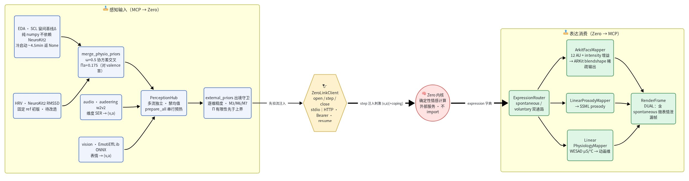
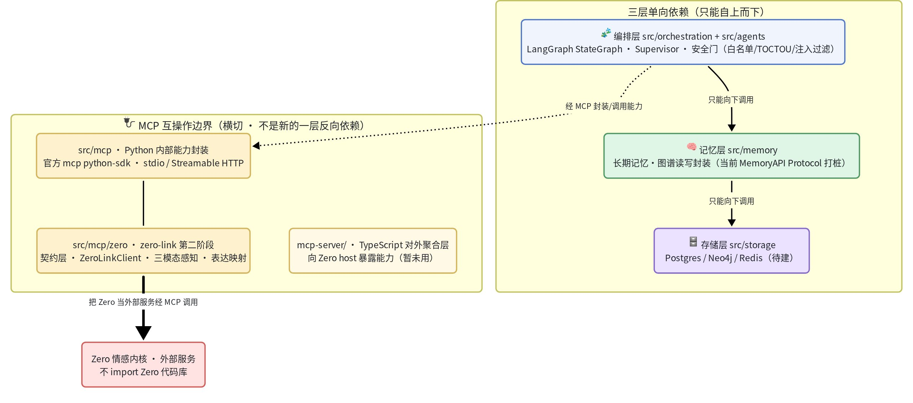

# Zero_MCP

经 **MCP（[Model Context Protocol](https://modelcontextprotocol.io)）**，给情感引擎驱动的 AI 数字人项目 **Zero** 扩展新的 **Agent 能力模块**。Zero_MCP 与 Zero 相对独立：把 Zero 当作**外部服务**经 MCP 调用，不直接耦合其代码库。

已落地两条能力线：**「桌面屏幕感知 + 电脑操控」**（Task 1-14 收口，真实桌面端到端标定）与 **「Zero↔MCP 情感对接（zero-link）」**（第二阶段已落地并并入 `main`：契约层 + client 真连 + 三模态感知真接入 + 真采集 I/O 适配层 + 表达映射器 + physiology 消费门控）。后续能力沿同一架构扩展。

## 能力一：桌面屏幕感知 + 操控

让 Agent 感知 Windows 桌面并执行操作，输出**模型无关的结构化文本**（不假设消费方是多模态模型）。

- **感知栈三层降级**：L1 UIA 系统接口（窗口级定位）· L2 RapidOCR（文本主通道）· L3 视觉（OpenCV 模板匹配 / 可选 OmniParser，**当前占位待扩展**，仅探测不跑推理）。**零训练**（不自训任何模型），**GPU 可选**（CPU 全功能兜底，ONNX EP 自适应 CUDA>DirectML>CPU）。
- **定向后台感知**：`screen_snapshot(window_handle=)` 指定目标窗口，经 `PrintWindow(PW_RENDERFULLCONTENT)` 直取窗口自身 DWM 渲染面——**被遮挡/无焦点/压 z 序底均可感知，不打扰正在用机的用户**；坐标恒为屏幕绝对（可直接驱动点击）。
- **关键实证**：微信 4.x（mmui 自绘）与钉钉 7.x 的 UIA 内容树实测覆盖率均 **≈0%**（钉钉 7/7 界面 hollow）——故感知默认 OCR 主通道、操控主路径为坐标点击，逐窗口探测 `uia_hollow` 自动切 OCR。
- **LangGraph 编排**：Supervisor / StateGraph，高危动作经 `interrupt` 人工确认门，停滞检测 + 断点续跑（Checkpointer）。
- **安全护栏在编排层**：三级白名单 + TOCTOU 二次截图比对（目标局部裁剪口径）+ 屏幕文字注入过滤（含 23 条中文越权词表，实测 FP=0/159；不依赖模型层防御）。

交付质量：单测 + 53 行为 evals 全绿，ruff + mypy strict 通过，独立 code-reviewer 审查 PASS；真实钉钉桌面端到端标定——感知成功率 7/7，OCR conf 均值 0.954，快照延迟 ~1.2s。

## 能力二：Zero↔MCP 情感对接（zero-link）

把 Zero 的情感/认知内核当**外部服务**经 MCP 对接：输入端把多模态感知归一成 `(valence, arousal)` 先验注入内核，输出端消费内核每轮的 `expression` 字典驱动渲染。**不 import Zero 代码库**——协议结构化镜像 + 跨仓活体回归（pytest marker `zerorepo`，`D:\Zero` 不在位自动 skip）。

- **边界契约层**：跨层数据形状唯一真相 `src/agents/models/zero_affect.py`（pydantic，字段/量纲逐条对 Zero 源码现场核验）——`(v,a)[+coping]` 刺激、多模态**独立先验流**（禁均值，竞争融合归内核）、`spontaneous`/`voluntary` 双通路 × 4 通道 expression（13 维 FACS〔12 AU + intensity 强度标量〕/ 韵律 / 生理 / 标签）。
- **Zero MCP client**（`ZeroLinkClient`）：会话句柄三段式 `zero.open_session / step / close_session` + `graceful_step` 优雅回退；stdio（本地子进程）与 Streamable HTTP（远程）双传输经 `.env` 切换。**已与 `D:\Zero` 真 MCP server 端到端联调通过**（stdio + HTTP + 真 13 维 FACS 权重全契约验证）。
- **三模态感知真接入**（算法团队文献门选型，全程可点击引文）：生理 NeuroKit2（EDA SCR / HRV RMSSD → arousal，对 valence 盲）· 语音 audeering w2v2 维度 SER · 视觉 EmotiEffLib **ONNX 后端**（零 timm，不动共用 conda 环境）。全部 pip 直装、CPU 可跑、零自训；缺库/缺模型/无输入一律 warning + 单通道降级，不拖垮整体。
- **真采集 I/O 适配层**（T3，`io_adapters/`）：把本地文件 / 合成信号包装成 async `signal_source` 注入四通道——`make_audio_file_source`（librosa 16kHz mono）· `make_vision_file_source`（FaceDetectorYN 人脸裁剪，BGR→RGB）· `make_synthetic_eda/hrv_source`（NeuroKit2）；**真硬件已实现**（`hardware_adapters`）：`make_mic_source`（sounddevice）· `make_camera_source`（cv2 VideoCapture + 可选 YuNet 人脸裁剪，即开即关不占设备）· `make_wearable_source`（pyserial 串口）——依赖为可选 extra（`hardware-audio` / `hardware-wearable`，默认不装），**工厂构造永不抛**，缺库/无设备/读取失败一律回退 `None`。适配层经构造器注入、**不进 Channel 核心**、脱硬件可测。
- **表达映射器**（引擎无关）：`ArkitFacsMapper`（12 AU + intensity 增益→ARKit 52 blendshape 系数，稀疏输出）· `LinearProsodyMapper`（韵律→倍率/半音/dB，可出 SSML `<prosody>`）· `LinearPhysiologyMapper`（**WESAD canonical**：心率/呼吸 + 皮肤电导 μS 归一 + 体温 °C，温度/瞳孔过渡期可空）；经 `RenderingExpressionSink` 产出 `RenderFrame`（`DUAL` 策略含 spontaneous 微表情泄漏帧——"真笑/假笑"表现力来源）。
- **physiology 契约 = WESAD 真信号**（07-23 对称接线拍板 + 消费门控落地，PR #2 → `main`）：canonical 三键 `{heart_rate_bpm, skin_conductance(μS[0,20]), temperature_c(°C)}`。跨仓迁移不原子，**保超集不收窄**（`hr`+`sc` 必填，`temperature_c`/`pupil_mm` 皆可选）——收到 Zero 的 legacy 或 canonical 两形状都不 `ValidationError`。⚠ **保超集 = 解析层零回归 ≠ 消费标度正确**：mapper 按 μS 标定，连 legacy 门关 Zero（sc∈[0,1]）须显式配 `skin_conductance_max_us=1.0`，否则默认再除 20 → 静默欠标度 ~20×（对抗审查揪出的 W6）。
- **external_priors 注入**（Q3 收口）：多流逐维 `(Πv,Πa)` 精度载荷 + 客户端 fail-fast（M3 精度上界 / M6 流数上界，与 Zero 两仓同名旋钮对齐）+ M5 schema 版本跨仓断言（`zerorepo` 测试期）。
- **默认关零回归**：`ZERO_LINK_ENABLED` 与三个感知通道 flag 全部默认 `false`，不影响既有能力。

zero-link 一轮数据流（感知先验注入 → Zero 确定性计算 → 表达消费驱动渲染）：



> 图源 [`docs/v2/zero-link-dataflow.mmd`](docs/v2/zero-link-dataflow.mmd)（mermaid，飞书画板渲染）。

## 架构

三层单向依赖，叠加 MCP 互操作边界（依赖只能自上而下）：



> 图源 [`docs/v2/mcp-architecture.mmd`](docs/v2/mcp-architecture.mmd)（mermaid，飞书画板渲染）。

- **运行态**（LangGraph Checkpointer）与**长期记忆**分离存储。
- **MCP 传输层不塞业务逻辑**：server 只注册工具 + 转发原语，感知/agent 业务逻辑留在 Python `src/*`。
- **MCP 层语言判据**：TS = 对外互操作边界；Python = 内部能力封装。感知库（pywinauto/mss/RapidOCR/NeuroKit2 等）是 Python 原语，故内部能力 server/client 用 Python 直连自建，不加 TS 桥。

## 技术栈

| 侧 | 语言 | 用途 |
| --- | --- | --- |
| 主 | Python 3.12 | LLM agent 框架（LangGraph）+ 编排/记忆 + MCP server/client + 感知/操控原语 |
| MCP 对外层 | TypeScript | `mcp-server/`，`@modelcontextprotocol/sdk`（对外聚合，暂未用） |

核心依赖：`langgraph` · `mcp`（python-sdk）· `pydantic` · `httpx` · `mss` · `rapidocr-onnxruntime` · `pywinauto`/`uiautomation` · `pyautogui` · `jinja2`。可选 extras：GPU 加速 `gpu-cuda`/`gpu-dml`/`omniparser`（CPU 为默认兜底）；zero-link 感知 `physio`（NeuroKit2）/`perception-audio`（torch/transformers）/`perception-vision`（emotiefflib ONNX）。

## 目录结构

```text
Zero_MCP/
├── src/
│   ├── orchestration/              # 编排层：LangGraph 装配 + Supervisor + 安全门
│   │   ├── desktop_graph.py            #   build 桌面任务 StateGraph：节点装配 + 条件边路由 + interrupt 断点续跑
│   │   ├── desktop_supervisor.py       #   Supervisor：LLM 决策下一步（只分发协调不含业务，模型 ID 走 .env）
│   │   ├── state.py                    #   结构化 state（pydantic）：节点只返回增量，大对象放引用
│   │   ├── protocols.py                #   下游打桩：MemoryAPI / SnapshotStore（memory/storage 落地前的 Protocol）
│   │   ├── phash.py                    #   感知哈希：TOCTOU 比对 + 停滞检测信号（目标局部裁剪口径）
│   │   ├── prompt_loader.py · prompts/ #   Jinja2 模板加载 + supervisor 模板（prompt 与代码分离）
│   │   └── safety/                     #   安全门
│   │       ├── action_guard.py             #     三级白名单 + TOCTOU 二次截图比对 + interrupt 人工确认
│   │       └── incident_reporter.py        #     异常现场包落盘 incident.json+截图（INCIDENT_DIR 默认关）
│   ├── agents/                     # Worker Agent 层（职责单一，经 state + Supervisor 协作）
│   │   ├── screen_perception_agent.py  #   屏幕感知：快照 → 模型无关结构化文本
│   │   ├── desktop_control_agent.py    #   桌面操控：动作规划与执行封装
│   │   ├── text_filter.py              #   屏幕文字注入过滤（23 条中文越权词表，实测 FP=0/159）
│   │   ├── protocols.py                #   agent 层协议
│   │   └── models/                     #   共享契约层（跨层数据形状唯一真相，pydantic）
│   │       ├── screen_snapshot.py          #     桌面感知契约（ScreenSnapshot / TextBlock / capture_origin）
│   │       └── zero_affect.py              #     Zero↔MCP 情感契约（(v,a) 刺激 / 先验流 / 13 维 FACS 双通路 expression）
│   ├── mcp/                        # MCP 互操作边界（Python = 内部能力封装）
│   │   ├── desktop_mcp_server.py       #   桌面能力 MCP server（FastMCP + stdio，10 工具，flag 默认关）
│   │   ├── desktop_mcp_client.py       #   编排层侧 client（spawn 子进程，异常三件套）
│   │   ├── desktop/
│   │   │   ├── capability_probe.py         #     启动能力探测：GPU EP 自适应 / OCR / OmniParser（幂等缓存）
│   │   │   └── tools/                      #     perception.py 感知原语（UIA/mss/RapidOCR/PrintWindow）· control.py 操控原语
│   │   └── zero/                       #   zero-link：Zero↔MCP 情感对接层（不 import Zero，协议镜像）
│   │       ├── client.py                   #     ZeroLinkClient：三段式会话 + stdio/Streamable HTTP + graceful_step 回退
│   │       ├── perception.py               #     PerceptionHub 多流汇聚（各模态独立先验，禁均值，融合归内核）
│   │       ├── expression_sink.py          #     ExpressionRouter：step_out 解析 + HeadPolicy 双通路分发
│   │       ├── external_priors.py          #     external_priors 载荷构造 + M3/M6 fail-fast + 各模态推荐精度
│   │       ├── protocols.py                #     Zero 协议结构化镜像（runtime_checkable，挂 path:line 证据）
│   │       ├── channels/                   #     感知通道：physio(NeuroKit2) / audio(audeering w2v2) / vision(EmotiEffLib ONNX) / callable
│   │       ├── io_adapters/                #     真采集 I/O 适配层（T3）：文件/合成 signal_source 工厂 + 硬件打桩（mic/camera/wearable）
│   │       ├── mappers/                    #     表达映射：facs(12 AU→ARKit 52) / prosody(→SSML) / physiology(WESAD μS/°C，引擎无关)
│   │       └── sinks/                      #     rendering.py：RenderingExpressionSink → RenderFrame（DUAL 含微表情泄漏帧）
│   ├── memory/                     # 记忆层（骨架：编排层经 MemoryAPI Protocol 打桩，待实现）
│   └── storage/                    # 存储层（骨架：Postgres / Neo4j / Redis，待建）
├── mcp-server/                     # TS MCP 对外聚合层（@modelcontextprotocol/sdk，独立 package.json，暂未用）
├── docs/v2/                        # 架构图：*.mmd（mermaid 源）+ *.png（飞书画板渲染，随仓提交，README 内嵌）
├── tests/                          # 1133 用例：agents/mcp/orchestration/safety/poc/e2e（marker：realenv 实机 · zerorepo 跨仓回归）
├── evals/                          # 53 条 agent 行为级 evals（感知/操控/停滞）
├── ai-docs/                        # 知识库：模块三件套 + catalog + pitfalls（本地维护，不入库）
├── notes/                          # 设计纪要 / 实测报告 / 工程实施记录（本地，不入库）
├── .env.example                    # 配置模板（cp 为 .env 启用；所有能力 flag 默认关）
├── pyproject.toml                  # 依赖与工具链（uv 装包；extras：gpu-cuda/gpu-dml/omniparser/physio/perception-audio/perception-vision）
└── environment.yml                 # conda 环境声明（复用 D:\Zero 的 affective-expression，勿 prune）
```

## 开发

```bash
# Python 侧（复用 conda 环境 affective-expression）
conda activate affective-expression
uv pip install -e ".[dev]"          # CPU 全功能；按需加 extras：.[gpu-cuda,dev]、.[physio,perception-audio,perception-vision,dev]
pytest tests/ -m "not realenv"      # 单测（realenv 用例需真实桌面，本地手动跑；zerorepo 用例缺 D:\Zero 自动 skip）
ruff check . && mypy

# MCP 对外服务层（TS，暂未用）
cd mcp-server && npm install && npm run typecheck
```

配置与密钥走 `.env`（复制 `.env.example` 填值，已 gitignore 不入库）。所有能力默认关零回归：屏幕能力 `SCREEN_CAPABILITY_ENABLED=false`、Zero 对接 `ZERO_LINK_ENABLED=false`、三感知通道 `ZERO_{PHYSIO,AUDIO,VISION}_CHANNEL_ENABLED=false`；zero-link 传输/模型/精度旋钮全走 `.env`（见 `.env.example` 注释）。

> 说明：本仓库仅跟踪 Zero_MCP 工程代码（`src/` · `tests/` · 配置）。项目自用的 Claude Code harness（`.claude/` · `CLAUDE.md`）、知识库（`ai-docs/`）、设计纪要（`notes/`）、PRP 工作区（`PRP/` · `ai-shared/`）、行为 evals（`evals/`）与交接文档（`HANDOFF.md`）经 `.git/info/exclude` 本地排除，不随本仓库提交，仅在本地开发环境维护。
